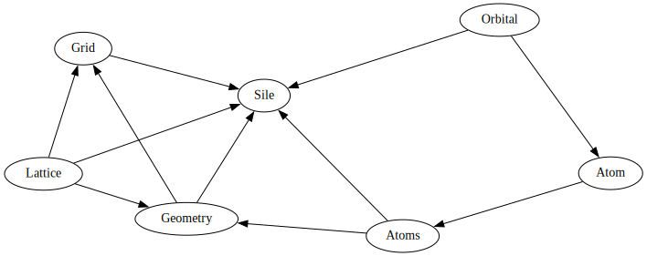

.. _overview:

*****************
Package overview
*****************

sisl is a Python package providing access to a large variety of things.

* creation and manipulation of geometries
* using orbitals for basis-set visualization purposes
* creating tight-binding matrices (:class:`~sisl.physics.Hamiltonian` and
  :class:`~sisl.physics.DynamicalMatrix` etc.) and manipulations (e.g.
  atomic or orbital sub-spaces)
* managing 3D real-space quantities such as density and potential grids
* unified interface for interacting with a broad range of electronic
  structure codes (see :mod:`sisl.io` for complete details)
* command line interfaces for parsing files on the fly for fast
  exploration of calculations

Units
-----

sisl assumes the user is careful in using consistent units.

The internal units in sisl are:

* Ang (Angstrom)
* eV (electron volt)

If you wish to introduce a specific unit, and its default, please open an `issue`_.

Data structures
---------------

sisl provides a broad set of datastructures, each providing
a unique set of capabilities.

The primary data structures includes:

======================= ====================================================================
Class                   Description
======================= ====================================================================
:class:`~sisl.Orbital`   Specifications of orbitals (sub-classed for various functionality)
:class:`~sisl.Atom`      Specifications of single atoms, species and orbitals
:class:`~sisl.Atoms`     A collection of :class:`~sisl.Atom` objects with smart
                         storage (no coordinates)
:class:`~sisl.Lattice`   Handling lattice-vectors, manipulations of lattices
:class:`~sisl.Geometry`  Lattice vectors + atoms and coordinates
:class:`~sisl.Grid`      Real space quantities for manipulation of 3D grid-data
:class:`~sisl.io.Sile`   IO-interactions, reading/writing electronic structure output/input
======================= ====================================================================

These *primary* classes, which covers the basic usage of sisl, has a dependency graph as shown below:

The vast majority of other data structures in sisl relies on these. For instance
:class:`~sisl.physics.Hamiltonian` relies on a :class:`~sisl.Geometry` object.

.. how to really setup these details, how should we
   group things together:

   - matrices
   - self-energy stuff
   - bloch's theorem
   - spin
