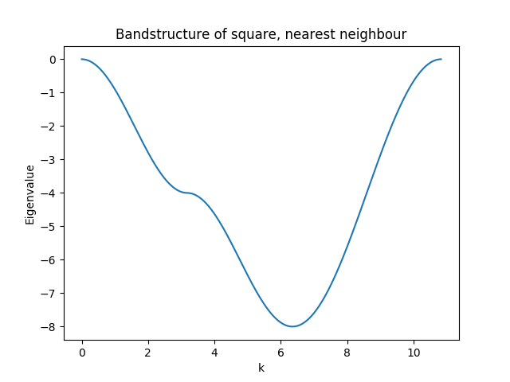
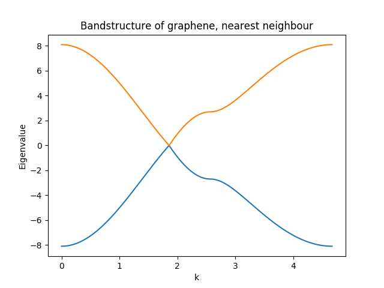

.. _tutorial-05:

Electronic structure setup -- part 1
------------------------------------

A `Hamiltonian` is an extension of a `Geometry`. From the `Geometry` it
reads the number of orbitals, the supercell information.

Hamiltonians are matrices, and in sisl all Hamiltonians are treated
as sparse matrices, i.e. matrices where there are an overweight of
zeroes in the full matrix.
As the Hamiltonian is treated as a matrix one can do regular assignments
of the matrix elements, and basic math operations as well.

Here we create a square lattice and from this a `Hamiltonian`::

  >>> geometry = Geometry([[0, 0, 0]])
  >>> H = Hamiltonian(geometry)
  >>> print(H)
  {spin: 1, non-zero: 0
   {na: 1, no: 1, species:
    {Atoms(1):
      (1) == [H, Z: 1, orbs: 1, mass(au): 1.00794, maxR: -1.00000], 
    },
   nsc: [1, 1, 1], maxR: -1.0
   }
  }

which informs that the Hamiltonian currently only has 1 spin-component, is
a matrix with complete zeroes (*non-zero* is 0).
The geometry is a basic geometry with only one orbital per atom as :math:`na = no`.

This geometry and Hamiltonian represents a lone atom with one orbital with zero
on-site energy, a rather un-interesting case.

The examples here will be re-performed in :ref:`tutorial-06` by highlighting
how the Hamiltonian can be setup in a more easy way.

Example -- square
~~~~~~~~~~~~~~~~~

Let us try and continue from :ref:`tutorial-01` and create a square 
2D lattice with one atom in the unit-cell and a supercell which couples only
to nearest neighbour atoms.

  >>> square = Geometry([[0.5,0.5,0]], sc=SuperCell([1, 1, 10], [3, 3, 1]))
  >>> H = Hamiltonian(square)

Now we have a periodic structure with couplings allowed only to nearest neighbour
atoms. Note, that it still only has 1 orbital. In the following we setup the on-site
and the 4 nearest neighbour couplings to, :math:`-4` and :math:`1`, respectively::

  >>> H[0, 0] = -4
  >>> H[0, 0, (1, 0)] = 1
  >>> H[0, 0, (-1, 0)] = 1
  >>> H[0, 0, (0, 1)] = 1
  >>> H[0, 0, (0, -1)] = 1
  >>> print(H)
  {spin: 1, non-zero: 5
   {na: 1, no: 1, species:
    {Atoms(1):
      (1) == [H, Z: 1, orbs: 1, mass(au): 1.00794, maxR: -1.00000], 
    },
    nsc: [3, 3, 1], maxR: -1.0
   }
  }

There are a couple of things going on here (the items corresponds to
lines in the above snippet):

1. Specifies the on-site energy of the orbital. Note that we
   assign as would do in a normal matrix.
2. Sets the coupling element from the first orbital
   in the primary unit-cell to the first orbital in the unit-cell neighbouring
   in the :math:`x` direction, hence ``(1, 0)``.
3. Sets the coupling element from the first orbital
   in the primary unit-cell to the first orbital in the unit-cell neighbouring
   in the :math:`-x` direction, hence ``(-1, 0)``.
4. Sets the coupling element from the first orbital
   in the primary unit-cell to the first orbital in the unit-cell neighbouring
   in the :math:`y` direction, hence ``(0, 1)``.
5. Sets the coupling element from the first orbital
   in the primary unit-cell to the first orbital in the unit-cell neighbouring
   in the :math:`-y` direction, hence ``(0, -1)``.

sisl does not intrinsically enforce symmetry, *that is the responsibility of the user*.
This completes the Hamiltonian for nearest neighbour interaction and enables the
calculation of the band-structure of the system.

In the below figure we plot the band-structure going from the :math:`\Gamma` point to the band-edge along :math:`x`, to the corner and back.

The complete code for this example (plus the band-structure) can be found :download:`here <tutorial_05_square.py>`.

Example -- graphene
~~~~~~~~~~~~~~~~~~~

A commonly encountered example is the graphene unit-cell. In a tight-binding picture
one may suffice with a nearest-neighbour coupling.

Here we create the simple graphene 2D lattice with 2 atoms per unit-cell and
a supercell of ``[3, 3, 1]`` to account for nearest neighbour couplings.

   >>> graphene = geom.graphene()
   >>> H = Hamiltonian(graphene)

The nearest neighbour tight-binding model for graphene uses 0 onsite energy and :math:`2.7` as the hopping parameter.
These are specified as this::

  >>> H[0, 1] = 2.7
  >>> H[0, 1, (-1, 0)] = 2.7
  >>> H[0, 1, (0, -1)] = 2.7
  >>> H[1, 0] = 2.7
  >>> H[1, 0, (1, 0)] = 2.7
  >>> H[1, 0, (0, 1)] = 2.7

	   
The complete code for this example (plus the band-structure) can be found :download:`here <tutorial_05_graphene.py>`.

